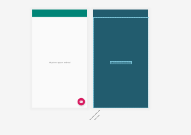

# unity
Cursito basico de unity

[Descargar de aqui los sistemas de particulas](https://sierra-guadalupe.org/unity/piromaniaco.unitypackage)

## Cinemachie
 Timeline es un secuenciador podemos añadir tracks y en es emismo track tener eventos y alli mismo  

 Cinemachine es el director de camas y permite añadir virutal cameras y pode hacer un blending de camaras

