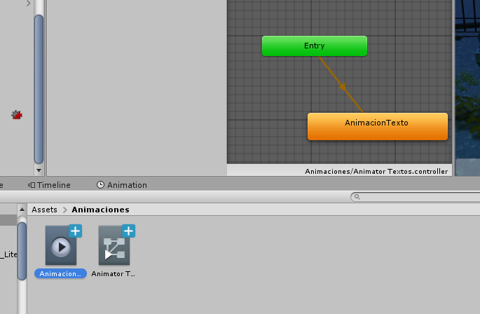

# unity
Cursito basico de unity

[Descargar de aqui los sistemas de particulas](https://sierra-guadalupe.org/unity/piromaniaco.unitypackage)

## Cinemachine
 
Cinemachine es el director de camaras y permite añadir cámaras virtuales y poder hacer un blending de camaras

Timeline es un secuenciador podemos añadir tracks y en es emismo track tener eventos y alli mismo agregar dichas secuencias de cámaras virtuales y otras animaciones.  

Primero debemos de crear un objeto vació que se llame Mis cut scenes del intro. Recetar la componente para que la ponga en ceros.  
Después creamos las cámaras virtuales y las agregamos adenrto de ese objeto vacio. 
Observa que en cuanto agrega la primer camara virtual tu Main Camera tiene en automatico la propiedad Cinemachine Brain, ya que sera la que maneje todoas las camaras virtuales.  
Posteriormente debes de posicionarte en la compnente de las CutScenes y en ella vas a agregar un timeline
Cuando lo hagas quitas el animator y en el boton de add le das click y agregas la opcione "Cinemachine timeline".  
 Ya despues en la timeline le das click y agrega "Add cinemachine shot" y en el slot que aparece en el inspector de propiedades agregas la camara virtual de tu prefernecias, para cada camara repites el procedimiento, aqui es donde puedes hacer un blending para tener un efecto de transicin mas profesional.
 

 ## Creando animaciones adicionales con Animator en la Timline de cinemachine
 Para ellos vamos  a dar click derecho en la ventana de a izquierda del timeline en cinemachi y generamos seleccionamos la opcion "Animation Track"  
 
 Una vez hecho esto  debes de agregar un nuevo Animator , que prevemante ya debes de haber construido con el
 animator controller, y en el debes de tener una o mas animaciones, en el caso de los zombies cuando construyes una desde mixamo, ya tiene una animacion, simplemente es cuestion de agregarla a tu animator controller, solo recuerda que es muy importante que tu Aanimator Contollr" este asociado a n objeto dentro de la escena o jerarquia de objetos, de otra manera no podras utilizarlo.   Ya despues de eso para especificar una animación en determinada camara virtual en la misma vntana de timeline le das click derecho, pro ahora en la venta de la derecha "Add from animation clip" donde estos clips son los clips que tu ya haz generado, de hecho lo puedes buscar por el nombre que le diste o como viene en el animator controller dicho clip, y alli lo acomodas en el timline en la camar virutal que tu desees, como se muestra en la siguiente figura
 

 En el caso de un texto o panel animados es importante que al panel le asignes un animator controller y ya en ese controller generas una nueva animacion con la opcion de "Create animation" coomo se muestra a continuacion 
 

Para hacer la animacion del texto, debes primero de seleccionar tu panel que ya tiene el controlador y la animation vacia que ya creaste y ya en a ventana de animation la puedes progrmar como desees, en caso de un texto selecciona animate Tranform y posicion z y ya con eso creas un inicio y un final, no olvidando grabar con el boton rojo coomo se muestra y agregarndo un key fram inicial y final, como se muestra en la figura. 

## Realizar un paneo
Para llevar a cabo un paneo primero agregamos en el Timline Add y seleccionamos Animation Track

  

Luego arrastramos hacia ese animator la camara virtual ubicada desde la jerarquia de objetos , sobre la cual deseamos crear como camara de paneo, al hacerlo alli mismo nos va a pedir crearle un nuevo animator, le decimos que si, y aceptamos el nombre que nos propone. Despue ya podemos epmezar a grabar con el botoncito rojo  y esplazamos nuestra camara virtual propuesta como de paneo.   
Aqui lo importante es mover la cama y no pasarte mas alla de lo que equivale a lo que dura su animacion a lo que pasas a la siguiente cámara, ya que no tendría sentido pues en la timeline pasarás a la camar virtual 2. 
Si en la Timeline no te gust+o un keyframe(rombito azul), simplemente le das clicl drecho y el das Edith in animation window y ya en la ventana de Animatio alli lo borrs, por esta razón es bueno que en unity tengas las dos ventanas, la de Timeline y la de Animation, una arriba de la otra, es práctico. 

##  Paneo con la propiedad Look At de una Virtual Camera

Este se ocupa para que podamos hacer paneo  sobre la propiedad Look At de la amara virtual, lo que hacemos es primero generar un objeto vacío y ya con ese lo animamos con una animation pero recuerda primer agregar un animation controller.
