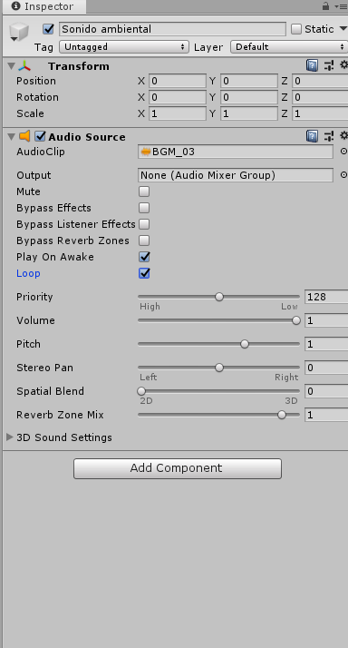
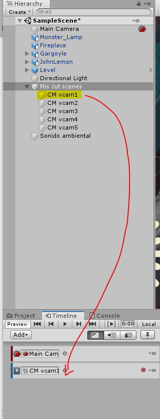

# unity
Cursito basico de cinematografía con cinemachine UNITY

[Descargar de aqui los sistemas de particulas](https://sierra-guadalupe.org/unity/piromaniaco.unitypackage)

## Cinemachine
 
Cinemachine es el director de camaras y permite añadir cámaras virtuales y poder hacer un blending de camaras

Timeline es un secuenciador podemos añadir tracks y en es emismo track tener eventos y ahi mismo agregar dichas secuencias de cámaras virtuales y otras animaciones.  

1-.Debemos de crear un objeto vació que se llame Mis cut scenes del intro y reseteamos la componente para que la ponga en ceros como se muestra:

  

2-.Después creamos las cámaras virtuales y las agregamos adentro de ese objeto vacio.

Observa que en cuanto se agrega la primer camara virtual tu Main Camera tiene en automatico la propiedad Cinemachine Brain, ya que sera la que maneje todas las cámaras virtuales, es importante mencionar que las cámaras virtuales debemos incorporarlas dentro de Mis cut scenes.

3-.Posteriormente nos posicionamos en la componente de Mis Cut Scenes y en ella agregamos un timeline.

4-.Le damos CREAR y a continuación le damos el nombre como se guardará y nos aparece la siguiente pantalla en la parte inferior:

5-.Le quitamos el Animator (remove component) y del TimeLine de igual forma borramos el None.

6-.Una vez que quitamos lo anterior, le damos ADD en el botón que se muestra a continuación y agregamos "Cinemachine Track"

7-.Arrastramos el MAIN CAMERA dentro de "Cinemachine Track"

8-.Nos pocisionamos en TimeLine y le damos click derecho para escoger la opción "Add cimemachine shot", el fragmento que nos creó lo posicionamos desde "0" y cambiamos el fragmento a segundos:

9-.Arrastramos la cam1 y la posicionamos del lado derecho en donde aparece Cinemachine Shot:

10-.Adherimos Cinemachine Shot tantas veces como cámaras tengamos, repitiendo el proceso del paso anterior.

11-.Ahora posicionamos las cámaras en las distintas áreas de la escena, para acomodarlas con al ángulo y altura de nuestra preferencia:

12-.Dentro de la barra de herramientas podemos usar la figura de imagen para laejar y acercar, la cruz que es para indicar los ejes del plano, las flechas inversas son para girar los ejes de manera esférica,etc.

Es importante mencionar que para poder estar seguro que se está moviendo la cámara seleccionada , en la parte derecha debemos seleccionar la opción "SOLO".

13-.Una vez que se tienen las cámaras posicionadas, procedemos a hacer el "blendig", es decir las cámaras se desplazarán de una a otra de acuerdo a la posición en la que se encuentren, ésto lo hacemos traslapando cada escena de una cámara a otra.

14-.Agregamos música a la animación de la siguiente manera, creamos un objeto vacio , click derecho seleccionamos AUDIO y la opción AUDIO SOURCE, lo reenombramos como Sonido ambiental.

Es importante darle reset para que nos posicione la bocina en el centro de nuestra escena.

15-.En nuestra carpeta de Audios, ya sea que ocupemos los que trae por default o descarguemos el sonido de nuestra preferencia.

16-.Arrastramos el audio para colocarlo dentro de las opciones del Sonido ambiental

17-.Para que el sonido se repita una vez terminado el TimeLine colocamos las opciones correspondientes como se muestra:

## Realizar un paneo

Un paneo es realizar el movimiento de la cámara a traves de la escena, del personaje mismo o de cualquier sitio que se quiera visualizar.
Para llevar a cabo un paneo primero agregamos en el Timeline ADD y seleccionamos Animation Track, esto se hará para cada cámara virtual que se hayan puesto en la TimeLine.

Arrastramos la primer cámara al Animation Track y la colocamos dentro de ésta.

Posicionamos el cursor del tiempo en 0 y comenzamos a grabar, presionando el punto rojo que se muestra en la imagen y comenzamos a mover la cámara.

Movemos el cursor del Time Line dependiendo de la duración del tiempo que queramos y continuamos grabando, moviendo la cámara a los distintos lugares que queramos.

Una vez que terminamos de cubrir el total del TimeLine de la cámara1 continuamos con la cámara2

 ## Creando animaciones adicionales con Animator en la Timline de cinemachine
 
 Para ellos vamos  a dar click derecho en la ventana de a izquierda del timeline en cinemachi y generamos seleccionamos la opcion "Animation Track"  
 
 Una vez hecho esto  debes de agregar un nuevo Animator , que prevemante ya debes de haber construido con el
 animator controller, y en el debes de tener una o mas animaciones, en el caso de los zombies cuando construyes una desde mixamo, ya tiene una animacion, simplemente es cuestion de agregarla a tu animator controller, solo recuerda que es muy importante que tu Aanimator Contollr" este asociado a n objeto dentro de la escena o jerarquia de objetos, de otra manera no podras utilizarlo.   Ya despues de eso para especificar una animación en determinada camara virtual en la misma vntana de timeline le das click derecho, pro ahora en la venta de la derecha "Add from animation clip" donde estos clips son los clips que tu ya haz generado, de hecho lo puedes buscar por el nombre que le diste o como viene en el animator controller dicho clip, y alli lo acomodas en el timline en la camar virutal que tu desees, como se muestra en la siguiente figura
 

 En el caso de un texto o panel animados es importante que al panel le asignes un animator controller y ya en ese controller generas una nueva animacion con la opcion de "Create animation" coomo se muestra a continuacion 
 

Para hacer la animacion del texto, debes primero de seleccionar tu panel que ya tiene el controlador y la animation vacia que ya creaste y ya en a ventana de animation la puedes progrmar como desees, en caso de un texto selecciona animate Tranform y posicion z y ya con eso creas un inicio y un final, no olvidando grabar con el boton rojo coomo se muestra y agregarndo un key fram inicial y final, como se muestra en la figura. 

## Realizar un paneo
Para llevar a cabo un paneo primero agregamos en el Timline Add y seleccionamos Animation Track

  

Luego arrastramos hacia ese animator la camara virtual ubicada desde la jerarquia de objetos , sobre la cual deseamos crear como camara de paneo, al hacerlo alli mismo nos va a pedir crearle un nuevo animator, le decimos que si, y aceptamos el nombre que nos propone. Despue ya podemos epmezar a grabar con el botoncito rojo  y esplazamos nuestra camara virtual propuesta como de paneo.   
Aqui lo importante es mover la cama y no pasarte mas alla de lo que equivale a lo que dura su animacion a lo que pasas a la siguiente cámara, ya que no tendría sentido pues en la timeline pasarás a la camar virtual 2. 
Si en la Timeline no te gust+o un keyframe(rombito azul), simplemente le das clicl drecho y el das Edith in animation window y ya en la ventana de Animatio alli lo borrs, por esta razón es bueno que en unity tengas las dos ventanas, la de Timeline y la de Animation, una arriba de la otra, es práctico. 

##  Paneo con la propiedad Look At de una Virtual Camera

Este se ocupa para que podamos hacer paneo  sobre la propiedad Look At de la amara virtual, lo que hacemos es primero generar un objeto vacío y ya con ese lo animamos con una animation pero recuerda primer agregar un animation controller. 
Una vez hecho esto, en tu Timeline de las Cutscenes vas a darle al boton Add  y procedes a agregar un Add Animator Tracj y ya en el slot vacio que se genera en el Timeline agregas tu objeto vacio que previamente ya tiene el animator controller. Despues porcedes a gravar los dos puntos del obejto vacio de este anomator track para que la opcion Look At mire mientras tu estas en la camara 4  
dfgd

d
]

