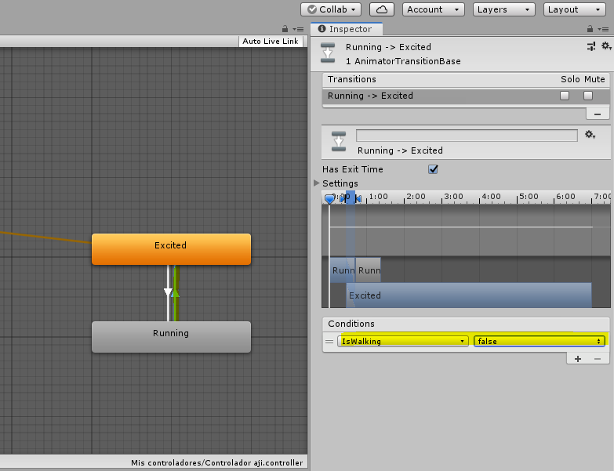
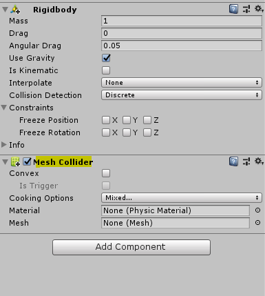
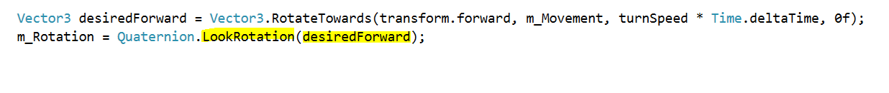

## CREACIÓN DEL PERSONAJE ANIMADO 

Con este tutorial crearemos un personaje en un videojuego y lo haremos mover con el joystick que previamente se descarga una vez comprado.

Este joystick lo adquirimos en la parte de Asset Store, en esta parte podemos adquirir una gran variedad de complementos para la ambientación de videojuego.

Lo primero que haremos será crear un escenario donde integraremos a nuestro personaje, con los movimientos que necesitamos para éste, además que ahi mismo podremos incorporar una gran cantidad de elementos para el ambiente del escenario.

En la parte de Assets, en la carpeta de Scenes ingresamos a ésta y creamos un nuevo proyecto, dentro de la carpeta Scene damos click derecho escogemos Create/scenes y nombramos el nuevo proyecto:

Una vez creado el proyecto ingresamos a el, unicamente tenemos dos objetos para trabajar, "Main Camara" y "Directional ligth".

Dentro del proyecto nos vamos a GameObject/3d object/Plane , una vez insertado el plano le cambiamos al dimensión del mismo como se muestra en la scale.

Dentro de la carpeta scenes, tenemos al personaje aj@Excited el cual vamos a arrastrar al centro del plano.

Una vez que colocamos al personaje en el plano, procedemos a posicionar la cámara en el lugar donde queramos que inicie el video juego, en este caso lo posicionamos viendo la espalda del personaje, nos posicionamos en la parte de "scene" y ahi nos colocamos en "Main Camera", y ahi podemos usar los recursos del menú para mover la camara ya sea alejarla o acercarla.

Para alinear la cámara, le damos en la opción GameObjetc y escogemos la opción Align With View, le damos en esa opción y la cámara se queda alinea justo donde queremos que inicie la imagen del videojuego.

Lo ponemos en modo de Game y le damos Play, ahi vemos como iniciará el personaje una vez inicializado el videojuego.

De igual forma colocamos la luz que hará la que indicará la dirección de las sombras o la parte que alumbrará al personaje en forma de "sol", repetriremos los mismos pasos que el anterior, es decir, seleccionamos la opción "Directonal Ligth", nos vamos a GameObject y le damos la opción Align with view.

Asi es como se vería la luz una vez que se acomodó la Directional ligth.

Para visualizarlo en el celular es necesario que se instale la app Unity remote 5, el cual nos ayudará para ver como se verá el videojuego en el mismo. 

Una vez instalado en el celular, procedemos a ligarlo con la computadora, nos vamos a File/ Build settings, selecciono el icono de Android y con ella la opción Switch Platform.

Posterior a eso seleccionamos la opción Add Open Scenes y nos agregará la que estamos realizando en ese momento

Para correrlo en el celular, nos vamos a Edit/Projects settings vamos a la opción Editor, en Device escogemos la opción Any Android Device.

Abrimos la app del celular Unity Remote 5, nos vamos a la opción de GAME en la computadora y le damos PLAY, lo que ocurrirá es que el videojuego se visualizará en el celular.

El siguiente paso es darle movimiento al personaje, esto lo haremos de la siguiente manera; vamos a crear un controlador separadamente, ya que cuando seleccionamos al personaje, éste no tiene ningún movimiento es decir, esta estático.

Para crear el controlador nos vamos a la carperta Assets ya que todas las animaciones tienen un controlador separadamente, creamos una nueva carpeta CREATE/FOLDER

Ingresamos a la carpeta creada, damos click derecho CREATE/ ANIMATOR CONTROLLER

Nos aparece la siguiente pantalla en donde agregaremos las animaciones,ahi podemos ver que por default tiene una entrada que es con la empiezan las animaciones y la que ligaremos nuestro controlador.

Para ligar la acción que queramos que tenga el personaje, tenemos que proporcionarsela, por lo que nos vamos a la carpeta Scenes, seleccionamos el movimiento que deseamos tenga el personaje como se muestra en la imagen y a continuación lo arrastramos a la parte donde se colocan los controladores.

Lo que vemos es que la acción que ingresamos se enlaza a la entrada de inmediato.

Para poder anexar el controlador al personaje,lo seleccionamos, ingresamos a nuestra carpeta que creamos la cual contiene el controlador que creamos previamente y lo vamos a arrastrar en la parte de INSPECTOR, colocamos el controlador en la casilla "Controller"

Quedará el controlador de la siguiente manera:

Nos vamos a la pestaña de GAME, le damos play para correr la animación y observamos que el personaje ya tiene un movimiento inicial.

Para que el movimiento del personaje sea constante, es decir que no se detenga, previamente cuando seleccionamos la acción que ejecutará el personaje, seleccionamos la opción "Loop time", el cual nos dará un movimiento constante.

Ahora procedemos a agregarle otra acción al personaje, en este caso vamos a darle la acción de correr, lo cual se hace ingresando a la carpeta de Scenes y vemos que tenemos la acción RUN, la cual arrastramos al área de controladores previamente creado.

Para poder visualizar el controlador de forma rápida, seleccionamos a nuestro personaje y en la parte izquierda de la pantalla nos aparece la parte de INSPECTOR y le damos doble click al nombre del controlador "Controlador aji"

Una vez que ya tenemos la nueva acción del personaje, arrastramos la acción en la parte de controladores, una ves que lo colocamos en esta parte vemos que se encuentra en color gris, esto es por que se encuentra inactivo.

Para activar la acción, necesitamos que nuestro personaje pase de la acción excited a run, esto lo vamos a hacer ligando éstas acciones. seleccionamos la acción excited, damos click derecho y escogemos la acción Make transition, una vez hecho esto nos movemos al rectángulo de run sin dar click, nos aparecerá una flecha la cual dirigiremos a la acción de Run.

Procedemos a hacer el mismo procedimiento de la acción running a excited.

En código esto indicará que con el joystick al usarlo pasaremos del estado excited al estado running.

Para poder utilizar esto posteriormente en el código, nos vamos en la parte de Parameters, le damos al signo más que tenemos en la parte derecha, seleccionamos la opción Booleano y reenombramos el parámetro como "IsWalking".

Seleccionamos la primer flecha que va de excited a running, nos pasamos a la parte izquierda de la pantalla que es de INSPECTOR, le quitamos la paloma que indica la opción Has exit time la cual hará que nuestro personaje se detenga,

En la parte de Conditions, seleccionamos el signo "+" y vemos que nos aparece el parámetro "IsWlaking" que habiamos creado previamente, y lo vamos a dejar como "true" ya que de estar excited pasa a running es verdadero.

Seleccionamos la segunda flecha y de igual forma hacemos el procedimiento anterior, pero ahroa en vez de seleccionar true seleccionamos "false"

## USO DE JOYSTICK 

Para incorporar el Joystick en el videojuego, nos vamos a la carpeta que descargamos previamente "Ultimate joystick", ingresamos a la carpeta Prefrabs y seleccionamos el icono que dice "Ultimate joystick" y lo arrastramos a la parte izquierda de nuestra pantalla.

Una vez que lo colocamos, le damos Play a nuestro videojuego y ya nos aparece colocado en la parte izquierda.

Lo que procede a continuación es programar el joystick, seleccionamos el objeto joystick y nos aparece un menú de lado derecho de nuestra pantalla en donde vemos un apartado para ponerle nombre a nuestro Joystick el cual será muy importante recordarlo ya que lo ocuparemos en nuestro código donde lo programaremos.

Para que nuestro personaje tenga caracteristicas fisícas como peso y gravedad, tendremos que agregarle componentes, en este caso le agregaremos Rigibody el cual detectará las colisiones, puede caerse en caso de no existir piso o alguna base donde camine

Fijamos los ejes X y Z para que siempre se mantenga en vertical.

Ahora le agregaremos características fisicas, en ADD COMPONENT/ PHYSISCS/ MESH COLAIDER, un mesh colaider es como si al personaje lo envolvieramos con una malla para saber que el personaje tiene una masa sólido.

Seleccionamos la opción MESH y escogemos Body01 y seleccionamos Convexo el cual cubrirá como una malla romboide al personaje.

Ahora el código que incluye la programación del joystick lo vamos a linkear con el personaje , esto lo hacemos seleccionando el código y lo arrastramos al nombre del personaje.

A continuación vemos que nos aparece de lado izquierdo el nombre del código como parte de unos de los componentes del personaje, podemos observar también que todos los atributos que nos aparecen en este parte de la pantalla, ya podemos invocarlos dentro del código para poder manipularlos y hacer que ejecuten las acciones que queramos.

El objeto Quaternion nos poermitirá rotar al personaje dentro de los ejes X,Y y Z

El método STAR es cuando inicializa el juego, activa la componente Animator y Rigibody para empezarlos a manipular.

El vector m_Movement es un vector 3D, en la primer parte del código indicamos que ajuste su valor a la posición del joystick (X,Y,Z)

Normalizamos el vector a 1 para poder ejecutar la acción que el personaje gire a la dirección que se le indica.

A continuación le damos una condición para que pueda avanzar, indicando que si es distinto de cero que se active la animación con el joystick.

Ahora si ambos objetos son distintos de cero, entonces ejecutará la acción de caminar que previamente a esa acción la nombramos como isWalking de tipo booleano.

Con el m_Animator ajustamos a un booleano que se llama "isWalking" que ese previamente lo nombramos en el diagrama al cambiar de un estado a otro.

El vector que se nombro como desiredForward , lo rotamos hacia (RotateTowards) con transforms el cual es una propiedad del objeto personaje y podemos acceder a esas 3 propiedades del vector X,Y y Z, lo que indicará este vector es que el personaje se dirija o se mueva hacia donde se mueva el joystick

Este vector al estar en 3d tiene sus tres componentes como se indica.

donde X= DIRECCIÓN
donde Y= VELOCIDAD (ángulo que es 40)
donde Z= VELOCIDAD DE ROTACIÓN (tiempo)

Cuando hay un cambio de vector existe un desplazamiento, el usuario ve una distancia, le tenemos que poner velocidad * tiempo

El LookRotation hace que el personaje gire hacia donde se le indica en el vector declarado,

Tenemos un nuevo método que se llama OnAnimatorMove que es un método propio de Unity, aqui indicamos que el personaje se mueva a la posición que tenga mas el vector de movimiento (m_Movement) que nos los da el joystick que sale de las variables que tiene el joystick

Variables del joystick

Esto es una suma de vectores y le ponemos el desplazamiento indicado con Time.deltatime

listo

 

